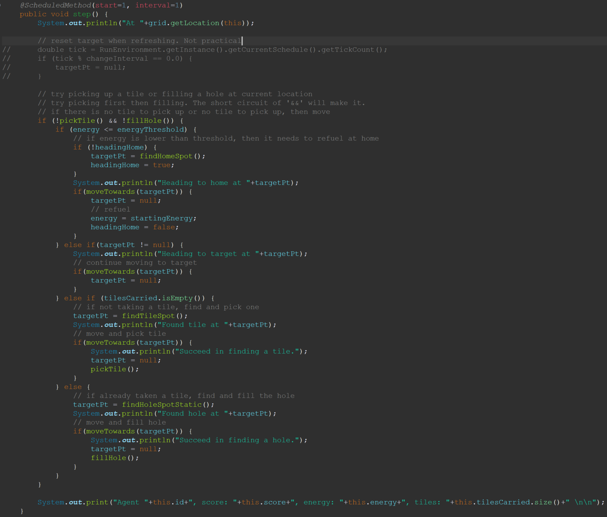
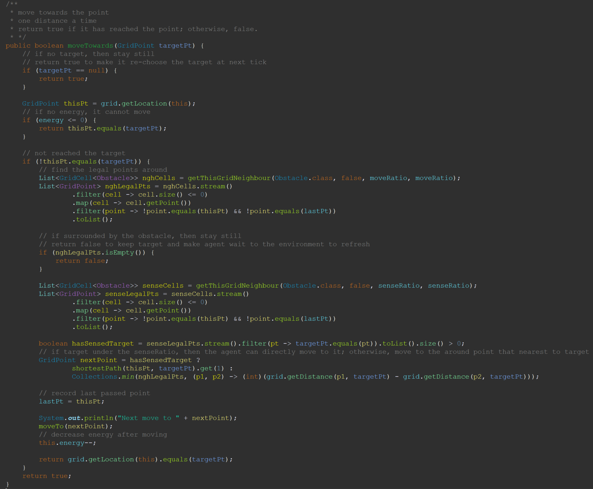
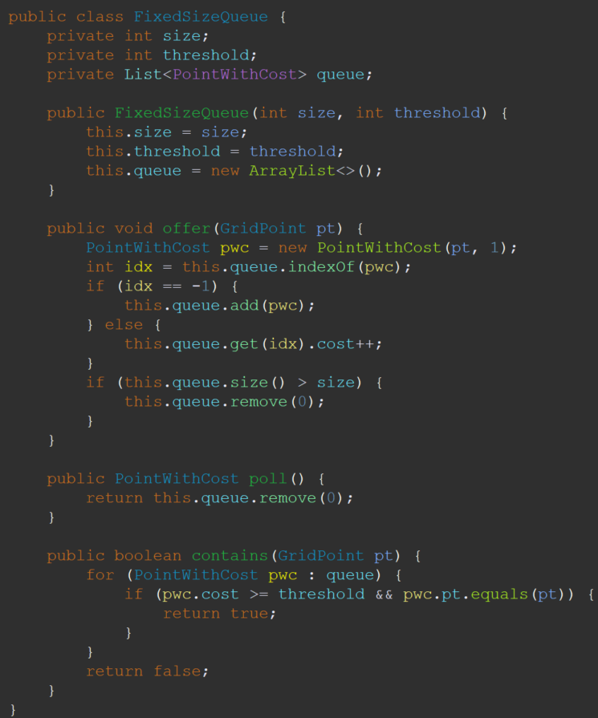
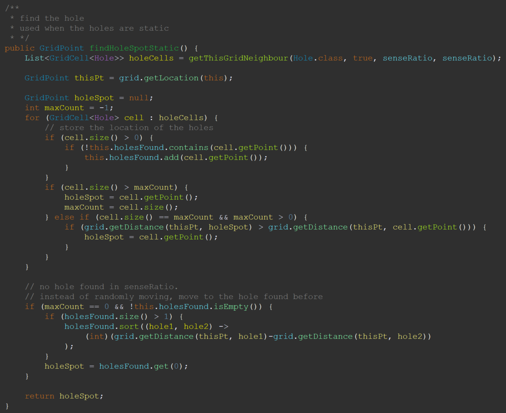
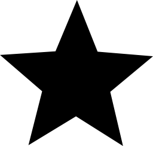
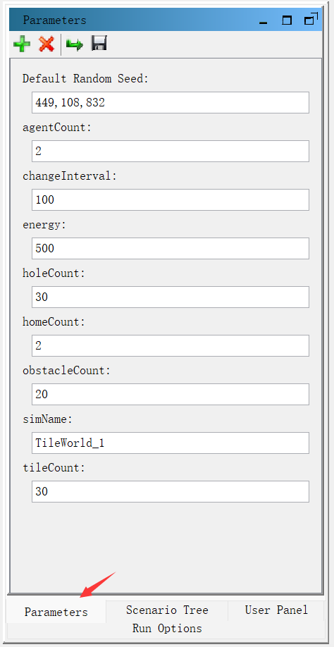
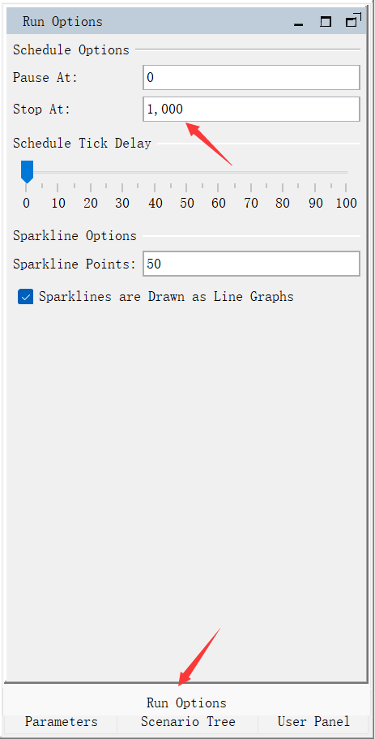

# ASSIGNMENT REPORT


**Assignment ID:** 1

**Student Name:** Liu Leqi（刘乐奇）

**Student ID:** 12011327

## DESIGN - BDI paradigm

- *Belief*: data sensed from the environment

There is a parameter called `senseRatio`. The agent can sense the things (tiles, holes, obstacles, homes) of the environment under this ratio.

- *Desire*: options from which the agent can choose to attain the goal.

  * option1: pick up a tile.
  * option2: fill a hole.
  * option3: find tiles.
  * option4: find holes.
  * option5: go to the home.

- *Intention*: actions that the agent will take.

  * plan1: 
  ```
    {
        NAME: "pick up a tile"
        GOAL: 
            ACHIEVE CARRY $TILE
        CONTEXT:
        BODY:
            EXECUTE CHOOSE $TILE
            EXECUTE PICK $TILE
            ACHIEVE CARRY $TILE
        FAILURE:
            EXECUTE print "== Pick failed! =="
    }
  ```
  * plan2: 
  ```
    {
        NAME: "fill a hole"
        GOAL: 
            ACHIEVE FILL $HOLE
        CONTEXT:
            FACT CARRY $TILE
        BODY:
            EXECUTE CHOOSE $HOLE
            EXECUTE REMOVE $TILE
            ACHIEVE FILL $HOLE
        FAILURE:
            EXECUTE print "== Fill failed! =="
    }
  ```  
  * plan3: 
  ```
    {
        NAME: "find tiles"
        GOAL: 
            ACHIEVE FIND $TILE
        CONTEXT:
            FACT EMPTY $TILE
        BODY:
            EXECUTE SENSE environment
            WHEN: TEST (> $TILE 0) {
                ACHIEVE FIND $TILE
            } ELSE TEST (> $ENERGY 0) {
                EXECUTE MOVE
                EXECUTE REDUCE $ENERGY 1
            }
        FAILURE:
            EXECUTE print "== Find tiles failed! =="
    }
  ``` 
  * plan4: 
  ```
    {
        NAME: "find holes"
        GOAL: 
            ACHIEVE FIND $HOLE
        CONTEXT:
            FACT CARRY $TILE
        BODY:
            EXECUTE SENSE environment
            WHEN: TEST (> $HOLE 0) {
                ACHIEVE FIND $HOLE
            } ELSE TEST (> $ENERGY 0) {
                EXECUTE MOVE
                EXECUTE REDUCE $ENERGY 1
            }
        FAILURE:
            EXECUTE print "== Find holes failed! =="
    }
  ``` 
  * plan5: 
  ```
    {
        NAME: "go to the home"
        GOAL: 
            ACHIEVE REFUEL
        CONTEXT:
            FACT <= $ENERGY $THRESHOLD
        BODY:
            EXECUTE SENSE_GLOBALLY environment
            LOOP: TEST (> $ENERGY 0 and not_reach_home) {
                EXECUTE MOVE
                EXECUTE REDUCE $ENERGY 1
            }
            ACHIEVE REFUEL
        FAILURE:
            EXECUTE print "== Go to the home failed! =="
    }
  ``` 

## DESIGN - Implement Details

### Step

At every interval, the agent will choose one of the plans depending on the current inner state and the outer environment.

1. The agent will sense the environment. 
   1. If there are some tiles at current location, then the agent will pick up the tile. 
   2. Else if there are some holes at current location and the agent is carrying some tiles, then the agent will fill the hole. 
   3. Otherwise,
      1. If the energy is not enough (less than the threshold), then the agent needs to change the target and head to home first.
      2. Else if there is no tile carried, then the agent will go to find a tile. 
      3. Otherwise, the agent will find a hole to fill.



### Move

#### Path

The agent must know how to reach the target as quickly as possible, i.e., it must run along the shortest path. Here I used two kinds of strategies to solve this problem.

1. If the target is not under the sense ratio, then the agent will move to the point that has the nearest straight line distance to the target.
2. If the target is under the sense ratio, then the agent will go along the path calculated by `A* algorithm`.

`A* algorithm` is a kind of heuristic search, where the agent will find the reachable path with least cost. Its rule is to minimize the following value. 

$$
f(n) = g(n) + h(n)
$$

where `g(n)` is the cost from the start point to the next point `n`, and `h(n)` is the heuristic function that estimates the cost from the next point `n` to the goal point. Here the heuristic function is the straight line distance from the next point to the goal point.

#### Obstacle

But how to prevent the influence of obstacles? There are two methods to solve this problem. 

1. Using a variable called `lastPt` to record the last point that the agent has passed. The agent will never choose `lastPt` as its next point to move.

The first case of Tileworld is shown as below. The agent is at E3, the target is at A3, and there are obstacles at C2, C3, C4. According to the action described above, the agent will move to D3, then D4 (or D2, symmetrically). If `lastPt` does not exist, the agent will then move to D3 since D3 has the shortest straight line distance to the target (A3). However, thanks to `lastPt`, this choice is filtered and the agent will move to C5, the second nearest point.

|     | 1   | 2   | 3   | 4   | 5   |
| --- | --- | --- | --- | --- | --- |
| A   |     |     | TP  |     |     |
| B   |     |     |     |     |     |
| C   |     | OB  | OB  | OB  |     |
| D   |     |     |     |     |     |
| E   |     |     | AG  |     |     |

|     | 1   | 2   | 3        | 4   | 5          |
| --- | --- | --- | -------- | --- | ---------- |
| A   |     |     | TP       |     |            |
| B   |     |     |          |     |            |
| C   |     | OB  | OB       | OB  | (AG, next) |
| D   |     |     | x=lastPt | AG  |            |
| E   |     |     | x        |     |            |

1. Using `A* algorithm` to bypass the obstacles.

The second case of Tileworld is shown as below. The difference is that the obstacle is asymmetric and its one side is touching the boundary of the world.

|     | 1   | 2   | 3   | 4   | 5   |
| --- | --- | --- | --- | --- | --- |
| A   |     |     | TP  |     |     |
| B   |     |     |     |     |     |
| C   |     | OB  | OB  | OB  | OB  |
| D   |     |     |     |     |     |
| E   |     |     | AG  |     |     |

The agent will first move to D3 and then to D2 (or D4 since both have the same shortest straight line distance to the target). However, at next time, since C1 is nearer to the target than D5, the algorithm will choose the path E3-D3-D2-C1 instead of E3-D3-D4-D5, which make it possible to bypass the obstacles.

|     | 1   | 2   | 3         | 4   | 5          |
| --- | --- | --- | --------- | --- | ---------- |
| A   |     |     | TP        |     |            |
| B   |     |     |           |     |            |
| C   |     | OB  | OB        | OB  | OB         |
| D   |     |     | x1=lastPt | AG  | (AG, next) |
| E   |     |     | x1        |     |            |

|     | 1          | 2   | 3         | 4   | 5   |
| --- | ---------- | --- | --------- | --- | --- |
| A   |            |     | TP        |     |     |
| B   |            |     |           |     |     |
| C   | (AG, next) | OB  | OB        | OB  | OB  |
| D   |            | AG  | x2=lastPt |     |     |
| E   |            |     | x2        |     |     |



#### Oscillation

Apart from the obstacles, the oscillation of the agent is also a problem. Suppose the Tileword is as blow.

|     | 1   | 2   | 3   | 4   | 5   |
| --- | --- | --- | --- | --- | --- |
| A   |     |     |     |     |     |
| B   |     |     |     |     |     |
| C   |     |     | OB  | AG  |     |
| D   |     |     |     |     |     |
| E   |     |     |     |     |     |

When there is no hole or no tile under the range of sense ratio, the agent will move randomly. Therfore, the grids (except obstacles) around the agent are all the possible choices and the agent may oscillate between these grids. As shown below, the agent may move around the obstacle or between two grids.

|     | 1   | 2           | 3            | 4                 | 5   |
| --- | --- | ----------- | ------------ | ----------------- | --- |
| A   |     |             |              |                   |     |
| B   |     |             | (AG, next)   |                   |     |
| C   |     | (AG, next') | OB           | AG, (AG, next''') |     |
| D   |     |             | (AG, next'') |                   |     |
| E   |     |             |              |                   |     |

|     | 1   | 2   | 3                        | 4               | 5   |
| --- | --- | --- | ------------------------ | --------------- | --- |
| A   |     |     |                          |                 |     |
| B   |     |     | (AG, next), (AG, next'') |                 |     |
| C   |     |     | OB                       | AG, (AG, next') |     |
| D   |     |     |                          |                 |     |
| E   |     |     |                          |                 |     |

To solve this problem, there is a queue `passedPts` to record the points which the agent has been to. This queue has a fixed size. When the agent passes a point, it will check if the point is in the queue. If it is, then the agent will increase its cost. Otherwise, the agent will record this point with 1 cost and pop out the head of the queue if the queue's size is larger than the fixed size. When choosing the next point to move to, the agent will also filter the queue's points with cost larger than the threshold. Emperically, I used (size, threshold) = (3, 2).



### Holes history

Since the holes are static (only tiles and obstacles are dynamic), we can record the location of the history passed holes. When the agent has carried some tiles and is going to find holes to fill, it will first sense the environment. Once the agent has found some holes, it will record the location of the holes and return the spot with most holes. If the agent cannot find any holes, it will check the history of the passed holes and return the spot with nearest hole.



### Record the information

I wrote some codes to collect the information of the simulation, such as the size and object counts of the environment, the score and energy of the agent at specific tick. The collector will start when the simulation begins, and will write the information into a `.csv` file when the simulation stops. 

Actually, the output file does not follow the standard form of `.csv`. I have modified its structure in order to show as much information as possible while keeping it readable.

The first two lines are the global data. Here is the description.


| simName                     | height                    | width                    | agentCount       | holeCount       | tileCount       | homeCount       | obstacleCount       | energy                          | changeInterval                             |
| --------------------------- | ------------------------- | ------------------------ | ---------------- | --------------- | --------------- | --------------- | ------------------- | ------------------------------- | ------------------------------------------ |
| the name of this simulation | the height of environment | the width of environment | number of agents | number of holes | number of tiles | number of homes | number of obstacles | the starting energy of an agent | the frequency that the environment changes |

Then after an empty line, there are the preserved information of the agents, group by tick. Here is the description.

| tick                                           | agent    | score              | energy                      | location             | target                              |
| ---------------------------------------------- | -------- | ------------------ | --------------------------- | -------------------- | ----------------------------------- |
| The simulation tick from starting, or interval | agent id | score of the agent | current energy of the agent | agent location point | the destination point for next move |

## RUNNING RESULT - Simulation

The parameters and simulation results can be seen in the source code files. Following are the icons indicating the characters.

 refers to the home, which is used to refuel.

 refers to the hole.

 refers to the tile.

 refers to the obstacle.

 refers to the agent.

### Setting parameters

The parameters can be set in the simulation runtime GUI. Here is the meaning of the parameters.

| parameter      | meaning                                    |
| -------------- | ------------------------------------------ |
| simName        | the name of this simulation                |
| changeInterval | the frequency that the environment changes |
| agentCount     | number of agents                           |
| tileCount      | number of tiles                            |
| holeCount      | number of holes                            |
| homeCount      | number of homes                            |
| obstacleCount  | number of obstacles                        |
| energy         | the starting energy of an agent            |



Meanwhile, the stop tick of the simulation can be set here.



Following are the fixed parameters for every simulation.

| parameter                     | value                       |
| ----------------------------- | --------------------------- |
| environment size              | (height, width) = (50, 100) |
| number of intervals to change | 100                         |
| stop tick                     | 1000                        |

### Structure of the source code files

The source code files are under the folder `src_code`. And its structure and descriptions are as below.

```
src_code
    ├─records           // simulation records
    ├─src               // source code
    │  └─tileWorld
    └─TileWorld.rs      // styles and parameters
```

## PROBLEMS

Eclipse is hard to use. But there is no support for IDEA or vscode due to the integration of Eclipse according to the developers' response.
