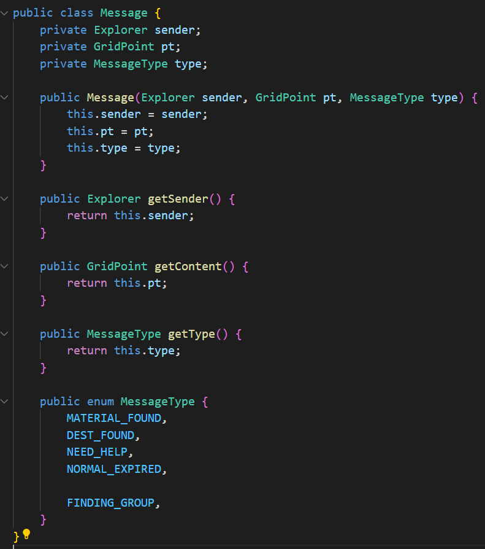
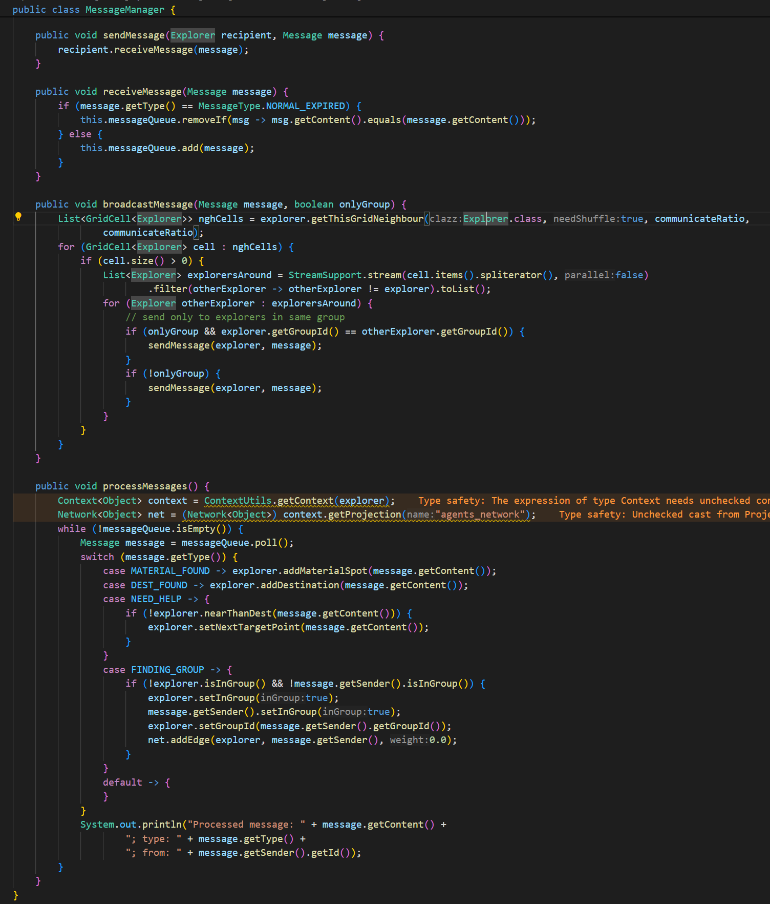
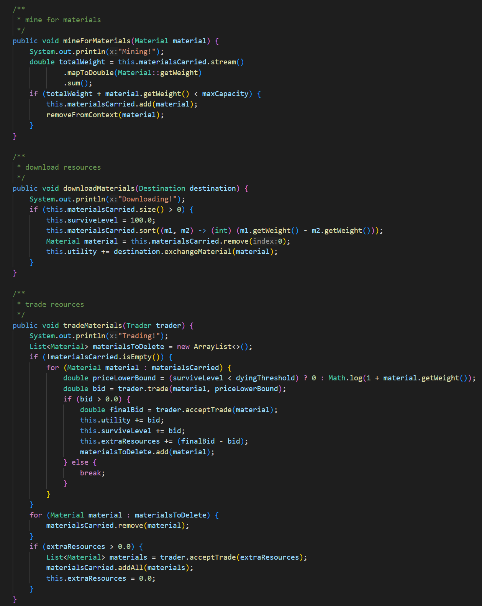

# ASSIGNMENT REPORT


**Assignment ID:** 2

**Student Name:** Liu Leqi（刘乐奇）

**Student ID:** 12011327

## DESIGN 

### Message Processing

The `Message` is changed to send location grid point so that the explorers can arrive at the target more easily.



The messages are processed by `MessageManager`



Notice that the group up process is finished here. `MessageManager` will set the group id and set the `inGroup` flag to true if both are sigle (not in group).

```java
case FINDING_GROUP -> {
    if (!explorer.isInGroup() && !message.getSender().isInGroup()) {
        explorer.setInGroup(true);
        message.getSender().setInGroup(true);
        explorer.setGroupId(message.getSender().getGroupId());
        net.addEdge(explorer, message.getSender(), 0.0);
    }
}
```

### Basic Process

The three basic processes are shown as below:



The first function is used to mine for materials, which is trivial that it just removes the material.

The second function is used to download materials to the destination. The survival level will come back to its maximum and the utility will be increased depending on the weight of the material.

The third function is used to trade with traders. Both survival level and utility will be increased depending on the weight of the material. During trading, the explorer will get some bonus as extra resources. If the explorer already has some extra resources, it can use them to trade for materials from the traders.

## Simulation

The parameters and simulation results can be seen in the source code files. Following are the icons indicating the characters.

 refers to the base station.

 refers to the destination.

 refers to the explorer.

 refers to the material.

 refers to the trader.

### Setting parameters

The parameters can be set in the simulation runtime GUI. Here is the meaning of the parameters.

| parameter   | meaning                 |
| ----------- | ----------------------- |
| explorerNum | the number of explorers |
| traderNum   | the number of traders   |

Following are the fixed parameters for every simulation.

| parameter                     | value                       |
| ----------------------------- | --------------------------- |
| environment size              | (height, width) = (50, 100) |
| number of intervals to change traders | 100                         |
| stop tick                     | 1000                        |

### Structure of the source code files

The source code files are under the folder `src_code`. And its structure and descriptions are as below.

```
src_code
    ├─records           // simulation records
    ├─src               // source code
    │  └─marsExplorer
    └─MarsExplorer.rs      // styles and parameters
```

## PROBLEMS

Eclipse is hard to use. But there is no support for IDEA or vscode due to the integration of Eclipse according to the developers' response.
