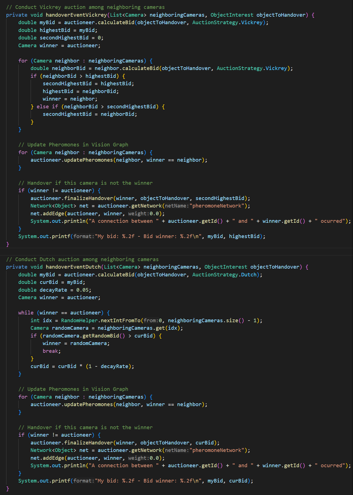
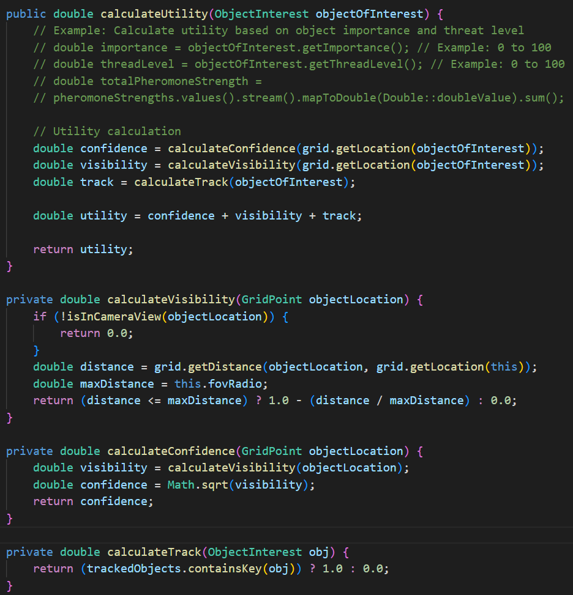
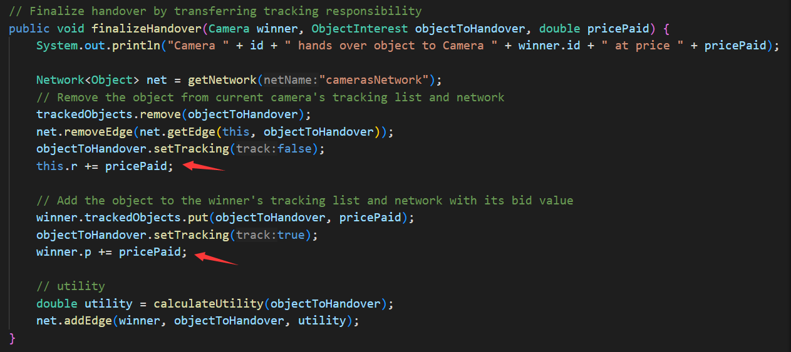
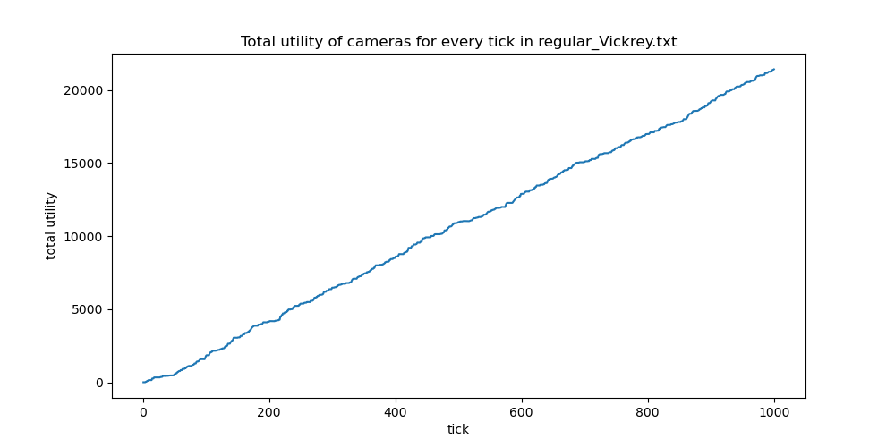
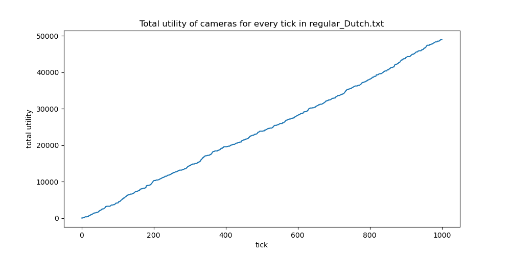
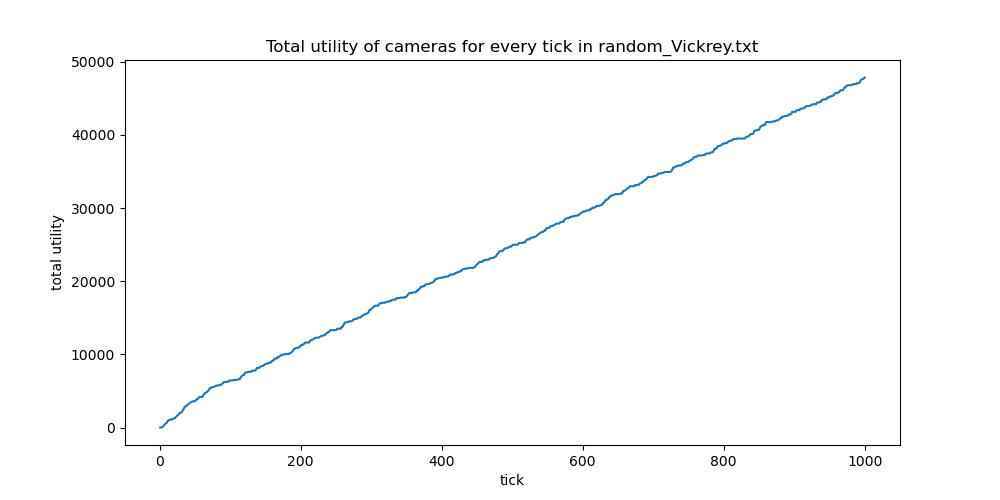
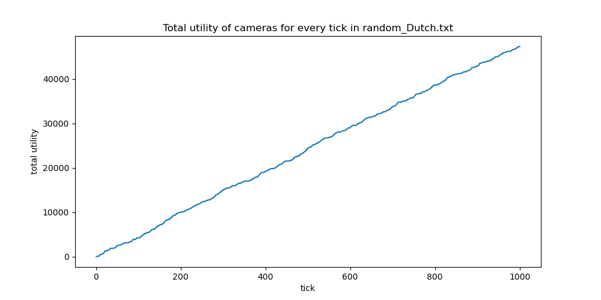

# ASSIGNMENT REPORT


**Assignment ID:** 3

**Student Name:** Liu Leqi（刘乐奇）

**Student ID:** 12011327

## DESIGN 

### Auction

There are two types of auction: Vickrey, and Dutch.

In Vickrey auction, the bidders has only one chance to bid, and the winner is the one with highest bid and the final saled price is the second highest bid.

In Dutch auction, it starts with a high bid and decreases the bid until there is a bidder stops and accepts the bid.



### Utility Calculation

According to the instruction, the utility of a camera can be calculated as below:

$$
\begin{align*}
    U_i(O_i,p,r)&=\sum_{j\in O_i}u_i(j)-p+r \\
        &=\sum_{j\in O_i}[c_j\cdot v_j\cdot \phi_i(j)]-p+r
\end{align*}
$$

For calculating the part: $\sum_{j\in O_i}[c_j\cdot v_j\cdot \phi_i(j)]$, where $c_j$ is the confidence, $v_j$ is the visibility, $\phi_i(j)$ is the characteristic function indicating whether the camera is holding the object, we implemented methods as below:



For $p$ (the sum of all payments paid in that tick) and $r$ (the sum of all payments received), we calculate them during the auction:



## Simulation

The parameters and simulation results can be seen in the source code files. Following are the icons indicating the characters.

 refers to the cameras.

 refers to the objects interested.

### Setting parameters

The parameters can be set in the simulation runtime GUI. Here is the meaning of the parameters.

| parameter   | meaning                 |
| ----------- | ----------------------- |
| auctionStrategy | the strategy used in auction, 0 for Vickrey, 1 for Dutch |
| isRandom   | whether the distribution of the cameras is random  |

Following are the fixed parameters for every simulation.

| parameter                     | value                       |
| ----------------------------- | --------------------------- |
| environment size              | (height, width) = (64, 64) |
| random seed | 389419806                         |
| stop tick                     | 1000                        |

### Structure of the source code files

The source code files are under the folder `src_code`. And its structure and descriptions are as below.

```
src_code
    ├─records           // simulation records
    ├─src               // source code
    │  └─multicameraTracking
    └─multicameraTracking.rs      // styles and parameters
```

## Results

The running records can be seen undet the `records` folder. Here we have plot the figures as below:










## PROBLEMS

Eclipse is hard to use. But there is no support for IDEA or vscode due to the integration of Eclipse according to the developers' response.
